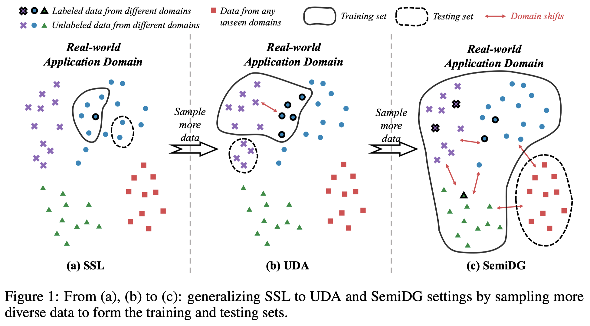
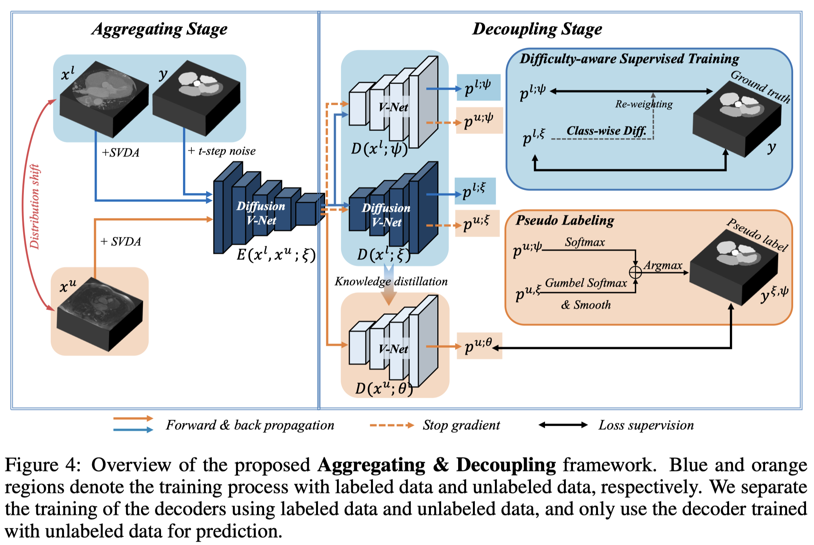
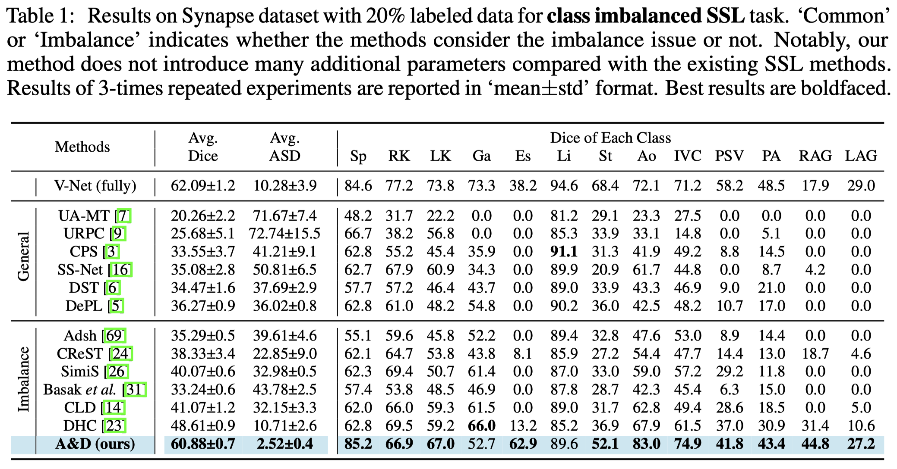
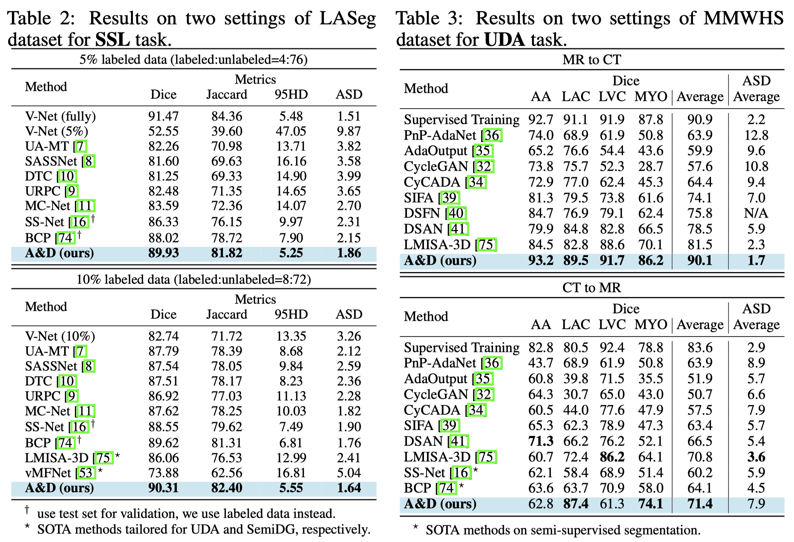
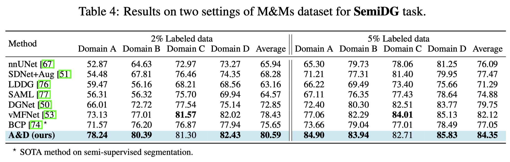

# [NeurIPS-2023] Towards Generic Semi-Supervised Framework for Volumetric Medical Image Segmentation

This repo is the official implementation of [Towards Generic Semi-Supervised Framework for Volumetric Medical Image Segmentation](https://arxiv.org/abs/2310.11320) which is accepted at NeurIPS-2023.

<p align = "center">    

</p>

<p align = "center">  

</p>


## 1. Environment

This code has been tested with Python 3.6, PyTorch 1.8, torchvision 0.9.0, and CUDA 11.1.

Before running the code, set the `PYTHONPATH` to `pwd`:
```shell
export PYTHONPATH=$(pwd)/code:$PYTHONPATH
```

## 2. Data Preparation

First, download the datasets and put them under the `Datasets` folder:
- **LASeg dataset** for SSL: download the preprocessed data from https://github.com/yulequan/UA-MT/tree/master/data. 

- **Synapse dataset** for IBSSL: The MR imaging scans are available at https://www.synapse.org/#!Synapse:syn3193805/wiki/.
Please sign up and download the dataset.

- **MMWHS dataset** for UDA: download according to https://github.com/cchen-cc/SIFA#readme.

- **M&Ms dataset** for SemiDG: download from https://www.ub.edu/mnms/, after unzipping the dataset, you will get an `OpenDataset` folder,
then you need to run the `python coda/data/split_MNMS_data.py` to spilt and get `MNMs` folder.

The file structure should be: 
```shell
.
├── Datasets
│   ├── LASeg
│   │   ├── 2018LA_Seg_Training Set
│   │   │   ├── 0RZDK210BSMWAA6467LU
│   │   │   │   ├── mri_norm2.h5
│   │   │   ├── 1D7CUD1955YZPGK8XHJX
│   │   │   └── ...
│   │   ├── test.list
│   │   └── train.list
│   ├── MMWHS
│   │   ├── CT
│   │   │   ├── imagesTr
│   │   │   │   ├── ct_train_1001_image.nii.gz
│   │   │   │   └── ...
│   │   │   └── labelsTr
│   │   │   │   ├── ct_train_1001_label.nii.gz
│   │   │   │   └── ...
│   │   └── MR
│   │       ├── imagesTr
│   │       └── labelsTr
│   ├── MNMs
│   │   └── Labeled
│   │       ├── VendorA
│   │       │   ├── A0S9V9
│   │       │   │   ├── A0S9V9_sa.nii.gz
│   │       │   │   ├── A0S9V9_sa_gt.nii.gz
│   │       │   ├── A1D9Z7
│   │       │   └── ...
│   │       ├── VendorB
│   │       ├── VendorC
│   │       └── VendorD
│   ├── OpenDataset
│   │   ├── Testing
│   │   ├── Training
│   │   ├── Validation
│   │   └── mnms_dataset_info.xls
│   └── Synapse
│       ├── imagesTr
│       │   ├──img0001.nii.gz
│       │   └── ...
│       └── labelsTr
│           ├──label0001.nii.gz
│           └── ...
```


### 2.1 Pre-process LASeg dataset
Run `python ./code/data/preprocess_la.py` to:
- convert `.h5` files to `.npy`.
- generate the labeled/unlabeled splits

### 2.2 Pre-process Synapse dataset

Run `python ./code/data/preprocess_synapse.py` to 
- resize the images and convert to `.npy` for faster loading; 
- generate the train/test splits (use labeled data for validation);
- generate the labeled/unlabeled splits.


### 2.3 Pre-process MMWHS dataset
Run `python ./code/data/preprocess_mmwhs.py` to:
- reorient to the same orientation, RAI;
- convert to continuous labels;
- crop centering at the heart region; 
- for each 3D cropped image top 2/% of its intensity histogram was cut off for alleviating artifacts;
- resize and convert to `.npy`;
- generate the train/validation/test splits.

### 2.4 Pre-process M&Ms dataset
Run `python ./code/data/preprocess_mnms.py` to:
- split the original 4D data to 3D along the time axis;
- crop and resize;
- save to `.npy`;
- generate the train/test splits (use labeled data for validation);
- generate the labeled/unlabeled splits.


For all the pre-processing, you can comment out the functions corresponding to splits and use our pre-split files.


Finally, you will get a file structure as follow:
```shell
.
├── Synapse_data
│   ├── npy
│   │   ├── <id>_image.npy
│   │   ├── <id>_label.npy
│   │   └── ...
│   └── split_txts
│       ├── labeled_0.2.txt
│       ├── unlabeled_0.2.txt
│       ├── train.txt
│       ├── eval.txt
│       ├── test.txt
│       └── ...
├── LA_data
│   └── ...
├── MMWHS_data
│   └── ...
└── MNMS_data
    └── ...
```


## 3. Training & Testing & Evaluating

🔥🔥 **This codebase allows train, test, and evaluate on all the four settings using one single bash file.** 🔥🔥

Run the following commands for training, testing and evaluating.

```shell
bash train.sh -c 0 -e diffusion -t <task> -i '' -l 1e-2 -w 10 -n 300 -d true 
```

Parameters:

`-c`: use which gpu to train

`-e`: use which training script, can be `diffusion` for `train_diffusion.py`, or `diffusion_2d` for `train_diffusion_2d.py`

`-t`: switch to different tasks:  
&nbsp; &nbsp; &nbsp; &nbsp; &nbsp; For SSL on `5%` labeled LA dataset: `la_0.05`   
&nbsp; &nbsp; &nbsp; &nbsp; &nbsp; For IBSSL on `20%` labeled Synapse dataset: `synapse_0.2`   
&nbsp; &nbsp; &nbsp; &nbsp; &nbsp; For UDA on MMWHS dataset: `mmwhs_ct2mr` for labeled CT and unlabeled MR, `mmwhs_mr2ct` in opposite  
&nbsp; &nbsp; &nbsp; &nbsp; &nbsp; For **SemiDG** on M&Ms dataset, `2%` labeled `B,C,D -> A` setting: `mnms_A_0.02`; `5%` labeled `A,B,C -> D` setting: `mnms_D_0.05`   

`-i`: name of current experiment, can be whatever you like

`-l`: learning rate

`-w`: weight of unsupervised loss

`-n`: max epochs

`-d`: whether to train, if `true`, training -> testing -> evaluating; if `false`, testing -> evaluating


## 4. Results & Model Weights


🌟🌟 **All trained model weights can be downloaded from** [this link](https://hkustconnect-my.sharepoint.com/:f:/g/personal/hwanggr_connect_ust_hk/Eo7WZlkTUwZKvJldxHPOWuEB-wSr11bztALadbsJITHlVA?e=0LCxgd). 🌟🌟

Put the `logs` directory under the root directory of this repo and set `-d False`, then you can test and evaluate the models.


### 4.1 Imbalance SSL on Synapse dataset



### 4.2 SSL on LASeg dataset & UDA on MMWHS dataset



### 4.3 SemiDG on M&Ms dataset



## Citations


If this code is helpful for your study, please cite:
```
@misc{wang2023generic,
      title={Towards Generic Semi-Supervised Framework for Volumetric Medical Image Segmentation}, 
      author={Haonan Wang and Xiaomeng Li},
      year={2023},
      eprint={2310.11320},
      archivePrefix={arXiv}
}
```


## Contact
Haonan Wang (hwanggr@connect.ust.hk)

## License

This repository is released under MIT License.

